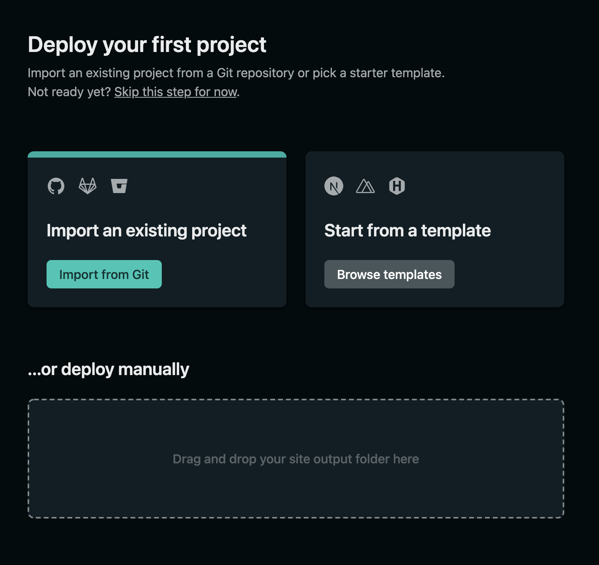
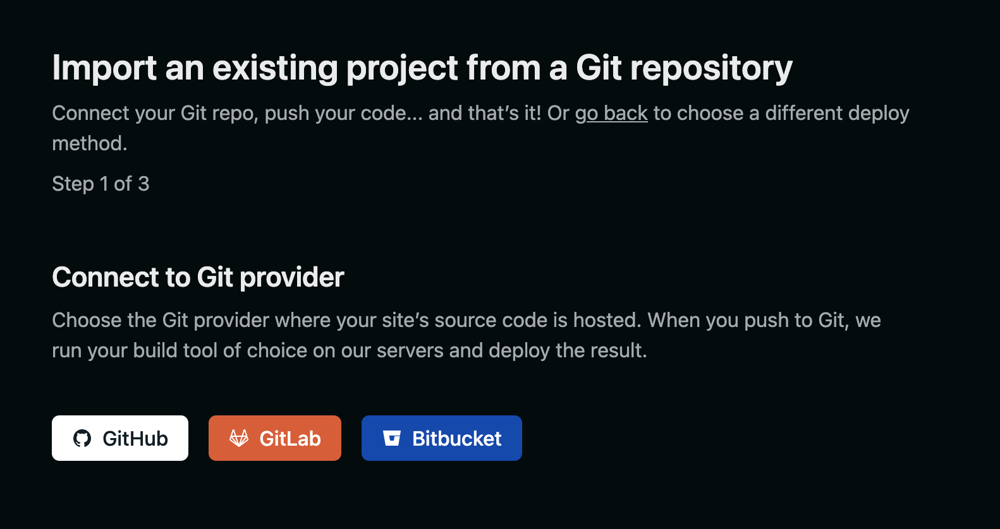
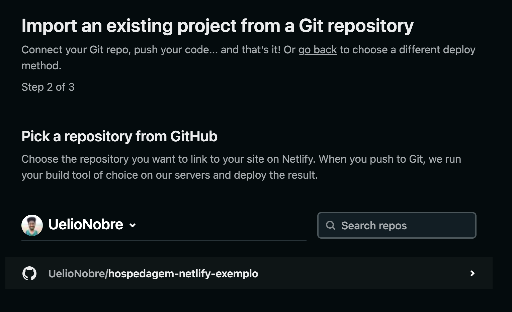
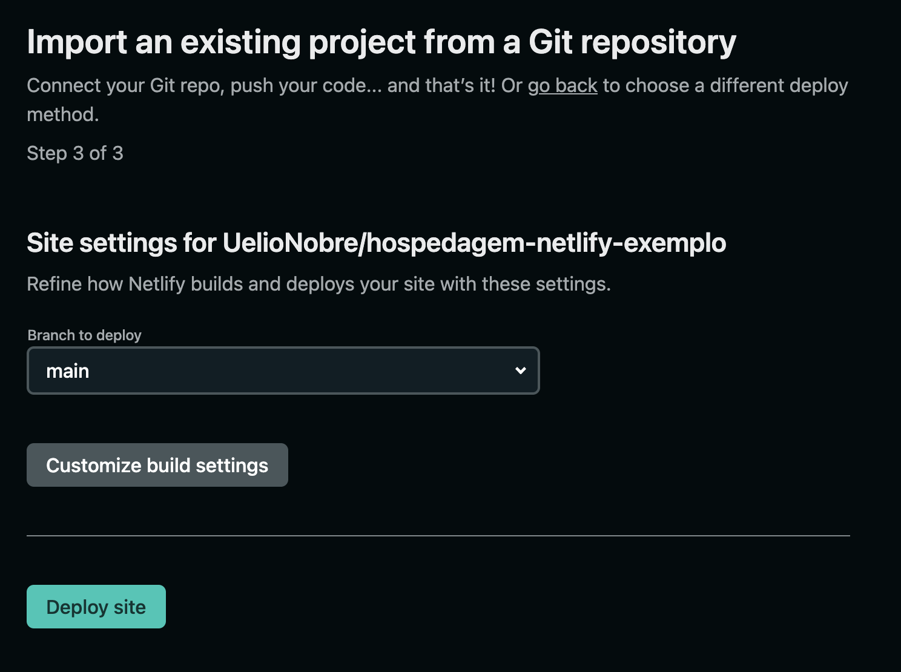

# hospedagem-netlify-exemplo

Usando o serviço do Netlify para hospedar projetos em NodeJS.

### Requisítos primários

- Ter um perfil criado no [Github]("https://github.com/")
- Ter um perfil criado no [Netlify]("https://www.netlify.com/")

### Requsítos secundários

- Noções de utilização do terminal Git.

---

### Tarefas

- #1 - Criar um repositório no `Github`
- #2 - Configurar criar arquivo `README.md`
- #3 - Adicionar o arquivo `README.md` no `HEAD` do `GIT`
- #4 - Alterar o nome do branch `master` para `main`
- #5 - Commitar as alterações.

O próximo passo, será a criação de uma conta no Netlify.

---

### Conta Netlify

Agora chegou a hora de criar uma conta no site do [Netlify]("https://www.netlify.com/"), o passo é bem simples: Vá no site da netlify e se cadastre, pronto!

---

Neste caso, estaremos utilizando o serviço de autenticação do [Github]("https://docs.github.com/pt/developers"), junto ao [Netlify]("https://www.netlify.com/").

### Tela iniciação de um novo projeto.

Depois, precisaremos de configurar uma plataforma de repositórios de códigos-fontes. Neste caso, estaremos utilizando o [Github]("https://github.com/").

Logo após, será apresentada uma tela de configuração do projeto em 3 etapas.

### 1 - Tela de importação do projeto.

### 2 - Escolhendo o projeto

Obs: Uma lista de repositórios serão listadas abaixo após o login no Github.

Clique e selecione o projeto que deseja implantar.

# 3 - Configuração do site.

Agora é só clicar em `Deploy site`.

---

